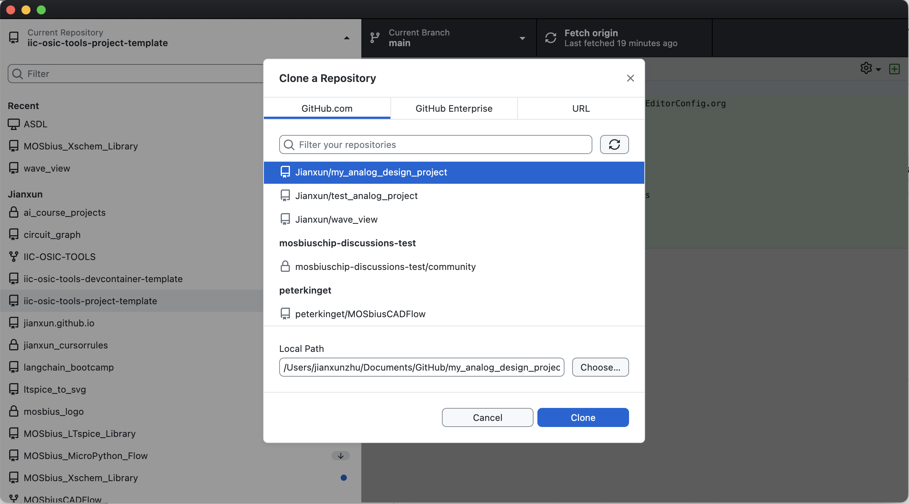
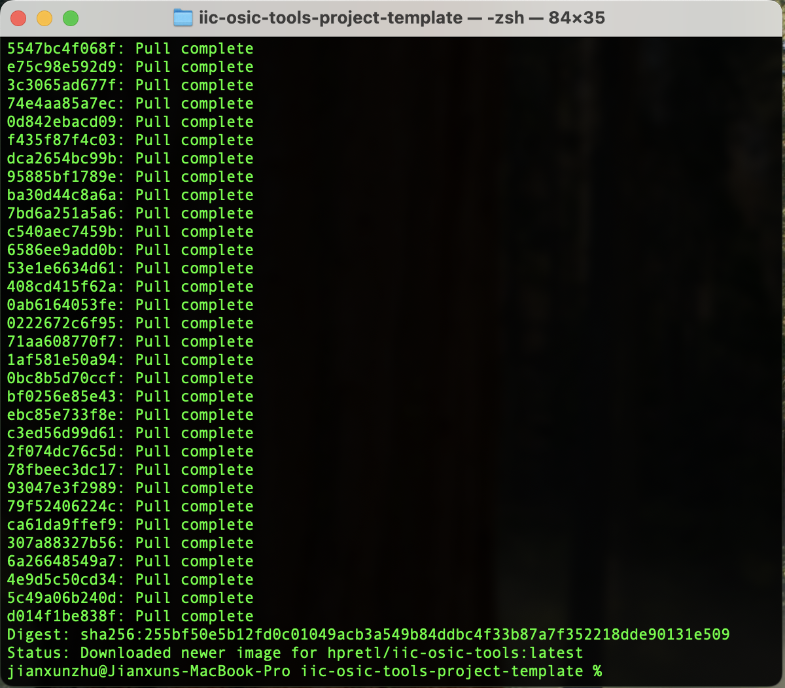
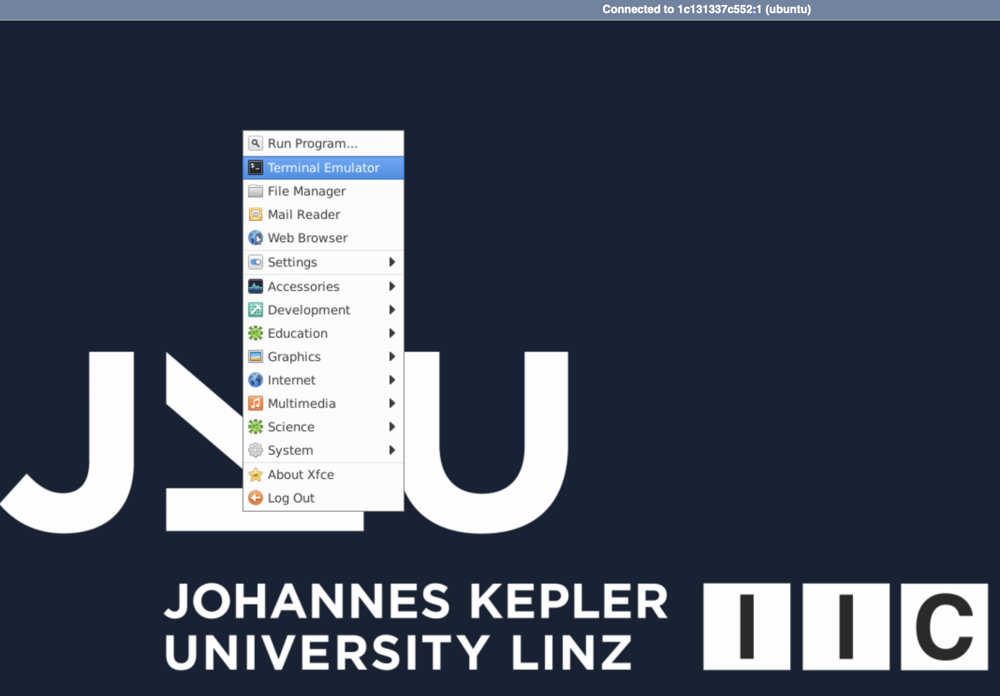

# IIC-OSIC-TOOLS Design Project Template (GlobalFoundries 180nm)

This repository is a project template for the IIC-OSIC-TOOLS (https://github.com/iic-jku/IIC-OSIC-TOOLS) analog design workflow, preconfigured for the GlobalFoundries 180nm PDK (gf180mcuD).

## What's Included

When you use this template, you get:

- **Pre-configured Docker environment** with IIC-OSIC-TOOLS and GlobalFoundries 180nm PDK
- **Cross-platform scripts** for launching the containerized design environment
- **Example analog design** (5-Transistor OTA) with proper library structure and testbench
- **Library organization standards** with validation scripts
- **VNC and web-based GUI access** for design tools like Xschem, Magic, and KLayout

## Prerequisites

Before you begin, you'll need to install the following software:

### 1. GitHub Desktop

- **Download**: [GitHub Desktop](https://desktop.github.com/)
- Available for Windows, macOS, and Linux
- Provides a user-friendly graphical interface for Git operations

You don't have to know how to use the git command. Although learning it helps you understand how the version control works. If you are an experienced user, feel free to manage your repository from CLI.

### 2. Docker Desktop

Docker is a lightweight, container-based alternative to virtual machines that ensures consistent development and deployment environments across different platforms by packaging applications with all their dependencies. Docker Desktop is its graphical user interface (GUI). 

**Download and Installation:**
- **Windows**: [Docker Desktop for Windows](https://docs.docker.com/desktop/install/windows-install/)
- **macOS**: [Docker Desktop for Mac](https://docs.docker.com/desktop/install/mac-install/)
- **Linux**: [Docker Desktop for Linux](https://docs.docker.com/desktop/install/linux-install/) or [Docker Engine](https://docs.docker.com/engine/install/)

**System Requirements:**
- **Windows**: Windows 10/11 with WSL2 enabled
- **macOS**: macOS 10.15 or newer
- **Linux**: 64-bit distribution with kernel 3.10+

In this project we will be using the IIC-OSIC-TOOLS docker (https://github.com/iic-jku/IIC-OSIC-TOOLS) to setup our development environments.

## Getting Started

### Step 1: Create Your Project Repository

#### Use GitHub Template

This repository is set up as a GitHub template. Using the template feature gives you a clean project without the template's commit history.

1. Visit the template repository: [https://github.com/Jianxun/iic-osic-tools-project-template/](https://github.com/Jianxun/iic-osic-tools-project-template/)
2. Click the green **"Use this template"** button
3. Select **"Create a new repository"**
4. Fill in your repository details:
   - Repository name (e.g., `my-analog-design-project`)
   - Description (optional)
   - Choose public or private
5. Click **"Create repository"**


**Clone your new repository using GitHub Desktop:**
1. Open GitHub Desktop
2. Click "Clone a repository from the Internet"
3. Select your newly created repository
4. Choose your local directory and click "Clone"



### Step 2: Launch the Docker Container

The project includes platform-specific scripts to launch the Docker container with the IIC-OSIC-TOOLS environment. Before running the following scripts, make sure your Docker Desktop is running.

#### For Mac/Unix/Linux Systems:
Open a terminal, navigate to you repository, and use the following command:
```bash
./start_vnc.sh
```

#### For Windows Systems:

**Open Command Prompt or PowerShell** navigate to you repository, and use the following command:


```cmd
.\start_vnc.bat
```
If you are familiar with git bash, feel free to use `start_vnc.sh`.

This will take a while to pull the latest IIC-OSIC-TOOLS image. Have a coffee.



### Step 3: Access the Design Environment

Once the container is running, you have two options to access the design environment:

#### Option A: VNC Client (Recommended for better performance)
1. Download a VNC client:
   - **Windows**: [TigerVNC](https://tigervnc.org) 
   - **macOS**: [TigerVNC](https://tigervnc.org)  or built-in Screen Sharing
   - **Linux**: `vncviewer` (install via package manager)

2. Connect to: `localhost:5901`
3. Enter password: `abc123`


#### Option B: Web Browser (noVNC)
1. Open your web browser
2. Navigate to: `http://localhost`
3. Enter password: `abc123`
4. Click "Connect"


### Step 4: Open a Terminal

Once you're in the VNC session:
1. Right-click on the desktop
2. Select "Terminal Emulator" (or similar option)
3. You should automatically be in the `/foss/designs` directory



### Step 5: Project Directory Structure

The `/foss/designs` directory inside the Docker container is mounted from the `designs` folder in this repository.

**Important:** Keep all your design files within the `designs` folder to ensure they persist when the Docker container is restarted.

```
project-root/
├── designs/              # Your design files (mounted in container as /foss/designs)
│   ├── libs/            # Design libraries
│   ├── simulations/     # Simulation results
│   └── setup_pdk.sh     # PDK setup script
├── start_vnc.sh         # Container launch script (Unix/Linux/Mac)
├── start_vnc.bat        # Container launch script (Windows)
└── README.md            # This file
```

### Step 6: Setup PDK Environment

Run the following command inside the terminal within the VNC session to set up the GlobalFoundries 180nm PDK:

```bash
source setup_pdk.sh
```


### Step 7: Launch Design Tools

Launch Xschem for schematic design:
```bash
xschem
```

You should see the Xschem GUI with available devices from `gf180mcu` and their testbenches.


## Troubleshooting

### Common Issues:

**Docker container fails to start:**
- Ensure Docker Desktop is running
- Check if ports 5901 and 80 are not in use by other applications
- On Windows, ensure WSL2 is properly configured

**Cannot connect via VNC:**
- Verify the container is running: `docker ps`
- Check firewall settings
- Try connecting to `127.0.0.1:5901` instead of `localhost:5901`

**Permission issues on Linux:**
- Add your user to the docker group: `sudo usermod -aG docker $USER`
- Log out and log back in

### Getting Help:

If you encounter issues:
1. Check the container logs: `docker logs <container-name>`
2. Restart the container: Stop and run the launch script again
3. Create an issue in the repository for persistent problems


## Library Structure Conventions

The project follows specific naming conventions for organizing design libraries under `/designs/libs/`:

### Directory Structure
```
/designs/libs/
├── core_*/          # Design libraries (core functionality)
├── tb_*/            # Testbench libraries
└── ...
```

### Naming Conventions
- **`core_*`**: Design libraries containing your core circuit implementations
- **`tb_*`**: Testbench libraries containing simulation and verification setups

### File Organization
Within each library directory:
- Each cell should have its own subdirectory: `/designs/libs/library_name/cell_name/`
- Files within a cell directory should be prefixed with the cell name (e.g., `cell_name.sch`, `cell_name.sym`)
- **Exception**: Testbench directories (starting with `tb_`) are exempt from the file naming prefix requirement

### Validation
Use the provided sanity check script to validate your library structure:
```bash
cd designs/CI
./library_check.sh
```

This script verifies:
- Proper directory hierarchy (no files at inappropriate levels)
- Correct file naming conventions for design libraries
- Exempts testbench libraries from strict naming requirements


## Example Design: 5-Transistor Single Stage OTA

This project includes a reference design to demonstrate the library structure and design flow:

### Libraries
- **Design**: 5-Transistor Single Stage Operational Transconductance Amplifier (OTA)
- **Library Location**: `core_analog`
- **Testbench Location**: `tb_analog`


### Usage
1. **Design Files**: Navigate to `/designs/libs/core_analog/` to find the schematics and symbols of the OTA cell and parameterized unit transistor cells.
2. **Testbench**: Use the verification setups in `/designs/libs/tb_analog/` to simulate and characterize the design.
3. **Validation**: Run the library check to ensure proper file organization:
   ```bash
   cd designs/CI
   ./library_check.sh
   ```

This example demonstrates the proper use of the library naming conventions (`core_*` for design libraries, `tb_*` for testbenches) and serves as a starting point for developing your own analog circuits.


## License

This project is licensed under the MIT License. See the [LICENSE](LICENSE) file for details.